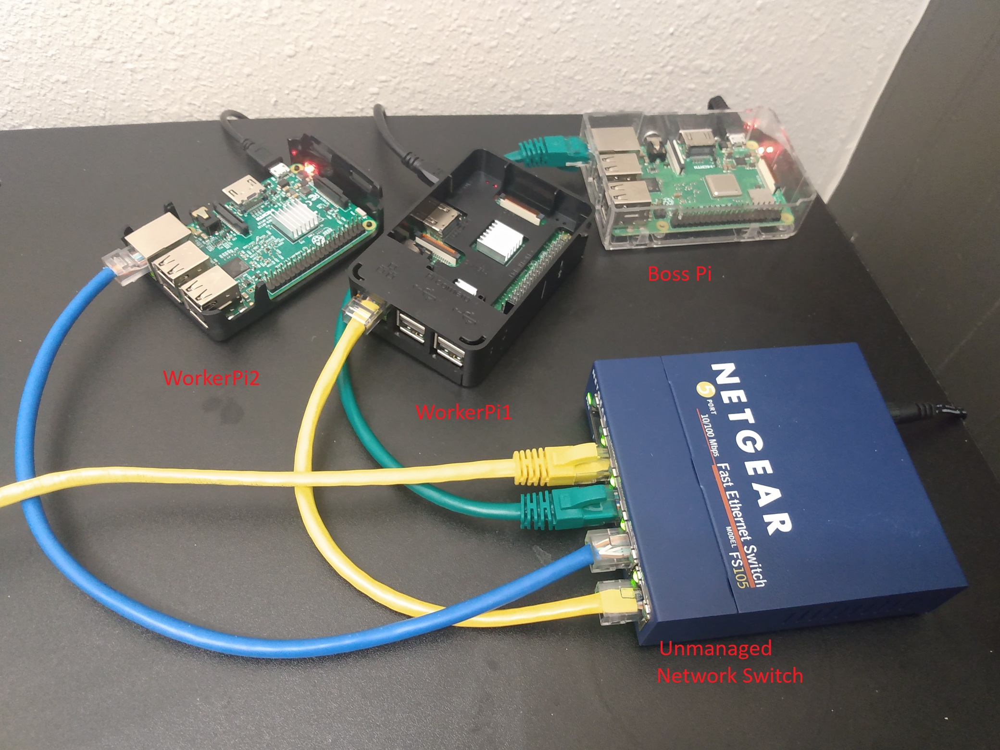

# DistributedGPT

This is a hobby project aimed at learning and experimentation. The primary goal is to explore whether cluster computing can be used to run a large language model (LLM) across multiple computers, ultimately finding a cost-effective way to operate an LLM on my own hardware. For this experiment, I’m using three Raspberry Pi devices, which were repurposed from previous projects and cost nothing additional. 

Currently, I’m running a distilled version of GPT-2, with each Raspberry Pi loading a portion of the model. While the setup is functional, it’s extremely slow, and the model outputs are practically useless—but it works! This sparks the question: why couldn’t this approach be scaled up using three affordable, used gaming PCs equipped with GPUs, such as NVIDIA RTX 3060s? This could potentially make cluster computing a viable and low-cost way to run an LLM entirely on local hardware.

## MPI

I've been reading *The Art of HPC* by Victor Eijkhout, an excellent resource for learning about cluster computing, parallel computing, and high-performance computing concepts.
* https://theartofhpc.com/

HTML online free version for a book about the science of computing, `The Art of HPC`, volume 1 by Victor Eijkhout:
* https://theartofhpc.com/istc/index.html

## Architecture
Cluster computing relies on networking to enable communication between computers. In my current setup, each Raspberry Pi uses a dynamic IP address assigned via DHCP by a router. For now, this is sufficient, as the project is more of a science experiment focused on rapid prototyping to explore what can be achieved. 

Future iterations will likely include static IP assignments and enhanced security measures. Ideally, the "Boss Pi" would be a computer with two NICs (network interface cards). One NIC would facilitate communication with the worker Pis on a dedicated subnet, while the other NIC would handle external access, limited only to the Boss Pi. This setup would allow the Boss Pi to manage tasks like running Ansible and hosting a web app for API interactions, ensuring both functionality and isolation.



## Setup Notes

On all 3 Pi's setup virtual env and install packages:
```bash
python3 -m venv ~/mpi_env
source ~/mpi_env/bin/activate
pip3 install torch --index-url https://download.pytorch.org/whl/cpu
pip3 install transformers bitsandbytes
pip3 install accelerate
pip install fastapi uvicorn
```

For mpi4py on Ubuntu Linux and Debian Linux systems, binary packages are available for installation using the system package manager: (dont use pip)
* https://mpi4py.readthedocs.io/en/stable/install.html#linux
```bash
sudo apt install python3-mpi4py
```

Update system level packages:
```bash
source ~/mpi_env/bin/activate
python3 -m venv ~/mpi_env --system-site-packages
source ~/mpi_env/bin/activate
```

Make sure Bosspi has Passwordless SSH Access to the worker Pi's:
```bash
ssh-keygen -t rsa
ssh-copy-id ben@192.168.1.x  # workerpi1
ssh-copy-id ben@192.168.1.x  # workerpi2
```

## Setup With Ansible
Notes automating tasks with Ansible.

- **Ansible Inventory**: Defines the cluster nodes and their connection details.
- **MPI Hostfile**: Specifies the nodes and slots for MPI execution.
- **Ansible Playbook**: Automates cluster health checks and MPI program execution.

### Ansible Commands

- **RUN ALL**: 
  Executes the entire playbook:
  ```bash
  ansible-playbook -i /home/ben/ansible_hosts /home/ben/update_and_reboot_pis_workflow.yml -vv
  ```

- **Update All Pis Without Rebooting**: 
  Skips the reboot task:
  ```bash
  ansible-playbook -i /home/ben/ansible_hosts /home/ben/update_and_reboot_pis_workflow.yml --skip-tags "reboot" -vv
  ```

- **Reboot Only Worker Pis**: 
  Executes only the reboot task:
  ```bash
  ansible-playbook -i /home/ben/ansible_hosts /home/ben/update_and_reboot_pis_workflow.yml --tags "reboot" -vv
  ```

- **Check Installed Python Packages**: 
  Filters for the package check tasks:
  ```bash
  ansible-playbook -i /home/ben/ansible_hosts /home/ben/update_and_reboot_pis_workflow.yml --tags "check_packages" -vv
  ```

- **Install Project Dependencies**: 
  Runs only the dependency installation tasks:
  ```bash
  ansible-playbook -i /home/ben/ansible_hosts /home/ben/update_and_reboot_pis_workflow.yml --tags "install_dependencies" -vv
  ```

- **Copy Files Over to Worker Pis**: 
  Executes only the file copy task of `main.py` from boss pi to worker pis:
  ```bash
  ansible-playbook -i /home/ben/ansible_hosts /home/ben/update_and_reboot_pis_workflow.yml --tags "copy_files" -vv
  ```
